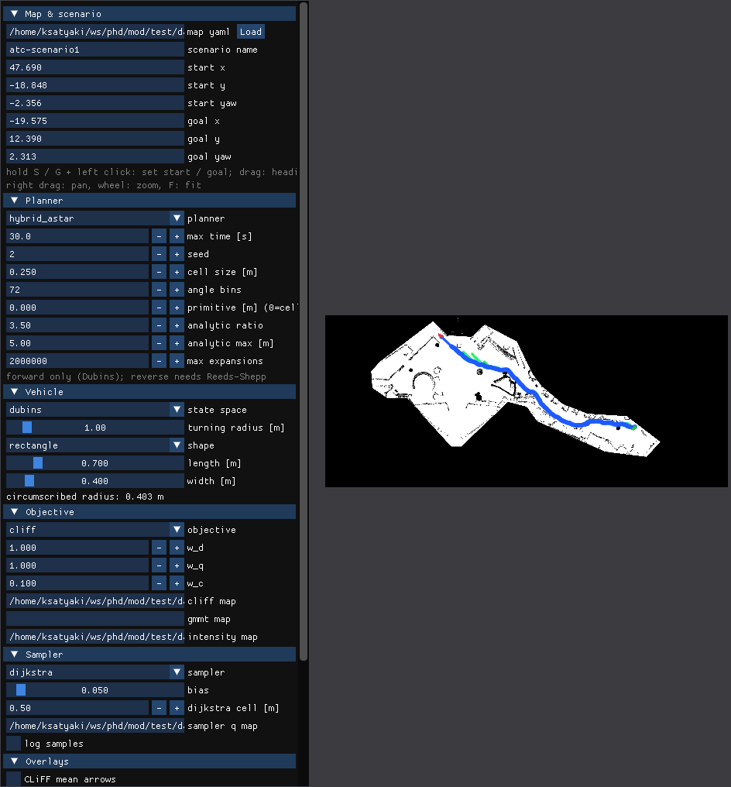

# mod — Maps of Dynamics for motion planning

`mod` lets a motion planner **follow the flow of people** instead of only avoiding walls. It reads a *Map of
Dynamics* (MoD) of a place, such as a shopping centre where thousands of pedestrian tracks were recorded, and
turns it into a cost that an [OMPL](https://ompl.kavrakilab.org) planner can optimize: paths that go *with* the
crowd are cheap, paths that cut across it or push upstream are expensive. It also ships informed samplers that use that same cost to steer the planner's
sampling towards low-cost solutions, a Hybrid A* planner that optimizes the same cost, and a **playground** for running and comparing all of this on real maps, with logs and plots.

If you just want to see it work, go to [Quick start](#quick-start). If you want the theory, read
[docs/concepts.md](docs/concepts.md) and the papers under [Background reading](#background-reading).



## What is in the box

| Part | What it does | Where |
|---|---|---|
| **MoD map readers** | CLiFF-map (Gaussian flow field), GMMT-map (Gaussian-mixture trajectory clusters), intensity map (how busy each cell is) | `include/mod/cliffmap.hpp`, `gmmtmap.hpp` |
| **Objectives** | OMPL optimization objectives: Down-The-CLiFF, upstream criterion (CLiFF or GMMT), intensity, plus plain path length | `include/ompl/mod/objectives/` |
| **Samplers** | Informed samplers that bias the planner's sampling with its own cost function: Dijkstra path, intensity map, ellipsoidal heuristic, and their hybrid | `include/ompl/mod/samplers/` |
| **Hybrid A\*** | Deterministic grid-and-primitive planner over the same maps, footprint and cost as the sampling planners | `include/mod/planners/hybrid_astar.hpp` |
| **Playground** | Headless batch runner with JSON logs, an ImGui app with map overlays, and Python plots | `src/playground/`, `analysis/` |
| **Maps** | Ready-to-use environments: the ATC shopping centre, a simulated warehouse and a simulated office | `maps/` |

Everything is a plain C++17 library with a CMake target (`mod::mod`). No ROS is required, although a
`package.xml` is included for `ament_cmake` workspaces.

## Quick start

### 1. Build

You need a C++17 compiler, CMake 3.16+, OMPL 2.0, Boost, Eigen 3, nlohmann_json, and for the optional parts
GoogleTest (tests), GLFW 3.3 + OpenGL (GUI) and Python 3 with numpy, pandas and matplotlib (plots). Distro
package lists are in [docs/getting-started.md](docs/getting-started.md).

```bash
git clone --recurse-submodules https://github.com/OrebroUniversity/mod.git
cd mod
cmake -S . -B build
cmake --build build -j
ctest --test-dir build        # optional: 51 tests, about 2 s
```

The library lands in `build/lib/libmod.so`, the tools in `build/bin/` (`run_batch`, `check_interpolation`,
`mod_playground_gui`) and the tests in `build/bin/tests/`.

### 2. Plan a path in the GUI

```bash
./build/bin/mod_playground_gui --map maps/atc/atc.yaml
```

Hold **S** and left-click to place the start, hold **G** and left-click for the goal (drag while holding to set
the heading), pick an objective and its map files with the `v` pickers, press **Solve**. Turn on the overlays to
see the CLiFF flow arrows, the intensity heat, the planner tree or Hybrid A*'s expanded nodes under the path.
Every solve is logged to a run folder. Full tour: [docs/gui.md](docs/gui.md).

### 3. Run an experiment headlessly

```bash
./build/bin/run_batch maps/atc/batch_atc_smoke.json --threads 4
python3 analysis/runs.py runs/atc_smoke              # table of every run
python3 analysis/plot_success.py runs/atc_smoke -o success.png
python3 analysis/plot_cost.py runs/atc_smoke -o cost.png
```

A batch JSON is the product *scenarios × planners × samplers × objectives × repeats*; each run writes
`config.json` and `solution.json` into its own folder. Format and fields:
[docs/batch-and-logs.md](docs/batch-and-logs.md).

### 4. Use it from your own code

```cpp
#include <ompl/mod/objectives/UpstreamCriterionOptimizationObjective.h>

MoD::OptObjParameters obj;                 // defaults are the published settings
obj.type = MoD::ObjectiveType::cliff;
obj.cliff_map_file = "maps/atc/atc_cliff.xml";
obj.intensity_map_file = "maps/atc/atc_intensity1m.xml";
obj.w_c = 0.1;
MoD::SamplerParameters smp;
smp.type = MoD::SamplerType::dijkstra;

auto objective = std::make_shared<ompl::MoD::UpstreamCriterionOptimizationObjective>(si, obj, smp);
objective->setCostStep(0.05);              // metres between cost points along an edge
pdef->setOptimizationObjective(objective); // RRT*, AIT*, ... now optimize the MoD cost
```

Link `mod::mod` (via `find_package(mod)` after `cmake --install`, or `add_subdirectory`). The objective allocates
the informed sampler the planner asks for. More in [docs/library.md](docs/library.md).

## How it works in one paragraph

An MoD stores, per location, how people move there: a CLiFF-map keeps a mixture of Gaussians over (heading,
speed); a GMMT-map keeps clusters of typical trajectories; an intensity map keeps how often the cell is visited.
The objectives integrate a cost along every planner edge at a fixed step: the steering distance, a small heading
term, and the MoD term evaluated at each point for the *direction the robot moves* (not the way it faces, so
reversing is costed like driving). The samplers do not look for where people walk: they use the planner's own cost function to concentrate
samples where a low-cost solution is likely (cells of a Dijkstra path under the MoD cost, cells weighted by the
intensity map, or the ellipse defined by the best cost so far), which is what makes RRT* and AIT* converge fast. Hybrid A* expands short arcs on a grid, costs
them with the identical objective and uses an MoD-aware Dijkstra cost-to-go as its heuristic, so its single
deterministic answer is directly comparable with the sampling planners. Details, formulas and defaults:
[docs/concepts.md](docs/concepts.md) and [docs/parameters.md](docs/parameters.md).

## Documentation

| Page | For |
|---|---|
| [docs/getting-started.md](docs/getting-started.md) | Installing dependencies, building, installing, troubleshooting |
| [docs/concepts.md](docs/concepts.md) | Maps, objectives, samplers, planners, footprint and cost definition |
| [docs/gui.md](docs/gui.md) | The playground app: controls, panels, overlays, command line |
| [docs/batch-and-logs.md](docs/batch-and-logs.md) | Batch JSON, run folders, `config.json` / `solution.json` / `samples.json`, plots |
| [docs/parameters.md](docs/parameters.md) | Every parameter, its default and its meaning |
| [docs/library.md](docs/library.md) | C++ API: maps, objectives, samplers, Hybrid A*, thread safety |
| [maps/README.md](maps/README.md) | The bundled environments and their scenario files |
| [analysis/README.md](analysis/README.md) | The Python scripts |
| [docs/development.md](docs/development.md) | Code layout, tests, style, plans, how to add an objective / sampler / planner |
| [CHANGELOG.rst](CHANGELOG.rst) | What changed per version, including the ATC comparison results |
| [Background reading](#background-reading) | The papers behind the objectives, samplers and maps |

## Results at a glance

On the six ATC scenarios with the four MoD objectives (30 s budget, 10 repeats), Hybrid A* solved every run in
under a second with a cost equal to or lower than RRT*'s and AIT*'s best after 30 s. The full table is in
[CHANGELOG.rst](CHANGELOG.rst), and the batch that produced it is `maps/atc/batch_atc_hybrid.json`.

## Background reading

The objectives and samplers in `mod` are the ones proposed and evaluated in these papers (Papers I, III and IV
of the author's thesis); the maps come from the referenced representations.

- **Down-The-CLiFF objective and intensity-map sampling.** C. S. Swaminathan, T. P. Kucner, M. Magnusson,
  L. Palmieri, A. J. Lilienthal, *Down the CLiFF: Flow-Aware Trajectory Planning under Motion Pattern
  Uncertainty*, IEEE/RSJ IROS 2018.
- **Benchmarking the objectives (upstream criterion on CLiFF and GMMT maps, DTC, intensity) with simulated
  pedestrians.** C. S. Swaminathan, T. P. Kucner, M. Magnusson, L. Palmieri, S. Molina, A. Mannucci, F. Pecora,
  A. J. Lilienthal, *Benchmarking the Utility of Maps of Dynamics for Human-Aware Motion Planning*, Frontiers in
  Robotics and AI 9, 916153, 2022.
- **The samplers (Dijkstra, intensity, hybrid) and the ATC experiments this playground reproduces.**
  C. S. Swaminathan, T. P. Kucner, A. J. Lilienthal, M. Magnusson, *Sampling Functions for Global Motion Planning
  Using Maps of Dynamics for Mobile Robots*, Robotics and Autonomous Systems 194, 105117, 2025,
  [doi:10.1016/j.robot.2025.105117](https://doi.org/10.1016/j.robot.2025.105117).
- **CLiFF-map.** T. P. Kucner, M. Magnusson, E. Schaffernicht, V. Hernandez Bennetts, A. J. Lilienthal, *Enabling
  Flow Awareness for Mobile Robots in Partially Observable Environments*, IEEE RA-L 2(2), 2017.
- **GMMT-map.** M. Bennewitz, W. Burgard, G. Cielniak, S. Thrun, *Learning Motion Patterns of People for Compliant
  Robot Motion*, IJRR 24(1), 2005.
- **The Dijkstra-graph sampling idea the Dijkstra sampler extends.** L. Palmieri, T. P. Kucner, M. Magnusson,
  A. J. Lilienthal, K. O. Arras, *Kinodynamic Motion Planning on Gaussian Mixture Fields*, IEEE ICRA 2017.
- **Maps of Dynamics in general.** T. P. Kucner, A. J. Lilienthal, M. Magnusson, L. Palmieri, C. S. Swaminathan,
  *Probabilistic Mapping of Spatial Motion Patterns for Mobile Robots*, Springer, 2020; and T. P. Kucner et al.,
  *Survey of Maps of Dynamics for Mobile Robots*, IJRR 42(11), 2023.
- **ATC dataset** (the bundled real map). D. Brščić, T. Kanda, T. Ikeda, T. Miyashita, *Person Tracking in Large
  Public Spaces Using 3-D Range Sensors*, IEEE THMS 3(6), 2013.

## For developers

The short version; the long one is [docs/development.md](docs/development.md).

- **Layout.** `include/mod` (maps, parameters, Hybrid A*, grid Dijkstra), `include/ompl/mod` (objectives,
  samplers), `src/` (implementations), `src/playground/{core,tools,gui}`, `test/` (GoogleTest), `analysis/`
  (Python), `maps/` (data), `AI-PLANS/` (the implementation plans with their settled decisions).
- **Build options.** `MOD_BUILD_TESTS` and `MOD_BUILD_PLAYGROUND` (both `ON`); `CMAKE_BUILD_TYPE` defaults to
  `Release`. `-DMOD_BUILD_PLAYGROUND=OFF` needs neither GLFW nor the ImGui submodule.
- **Conventions.** C++17, `.clang-format` (Google, 120 columns), `-Wall -Wextra` clean. Console logging is one
  macro, `MOD_LOG`, that prints `[mod] ...` to stderr. New code lives in namespace `MoD` (a global `mod`
  namespace collides with Boost.Geometry). Objectives and samplers hold no mutable per-call state; maps are shared
  as `shared_ptr<const>`, so one planner per thread is safe.
- **Tests.** `ctest --test-dir build`. Test data is `maps/` (through `MOD_TEST_DATA_DIR`); synthetic maps are built
  in-memory in the tests themselves.
- **Plans and changelog.** Every feature was planned in `AI-PLANS/*.md` with a settled-decisions table; the
  decisions there are binding. Record user-visible changes in `CHANGELOG.rst`; bump the version in
  `CMakeLists.txt` and `package.xml` together.
- **Attribution.** Borrowed code carries its licence header in-file and a row in `3rd_party_licenses.md`;
  design-only borrowings (bench-mr, Nav2) are noted in the files that follow them.

## Acknowledgements and licence

The experiment pipeline follows [bench-mr](https://github.com/robot-motion/bench-mr) (MIT, Eric Heiden and
contributors) and the MoD additions in [ksatyaki/bench-mr](https://github.com/ksatyaki/bench-mr), which ran the
published experiments; no bench-mr source is included, but the maps, start/goal pairs, objective wiring, solution
timing, batch expansion and figure design are derived from it and marked as such. The Hybrid A* planner follows the
design description of Nav2's SmacPlannerHybrid (Apache-2.0, Steve Macenski et al.); no Nav2 code is included. The
ATC occupancy map comes from the ATC pedestrian dataset (Brščić, Kanda, Ikeda, Miyashita, IEEE THMS 2013). The GUI
uses Dear ImGui (MIT).

`mod` is LGPL-3.0 (`LICENSE`). Third-party code and data are listed with their licences in
[3rd_party_licenses.md](3rd_party_licenses.md). Maintained by Chittaranjan Swaminathan, Örebro University.
